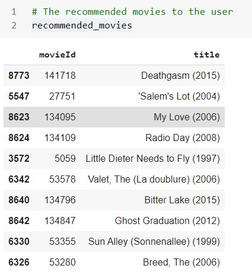

# CSE523-Machine-Learning-SSSR
CSE523 Machine Learning SSSR repository contains a movie recommendation system using KNN, ALS and SVD algorithm.

# Movie recommendation system #

## Introduction
We have made a movie recommendation system using collaborative filtering where we have used both memory-based and model-based collaborative filtering.
So we implemented 3 algorithms
- K-Nearest Neighbours(KNN) 
  It is a memory-based clustering algorithm
  
- Alternating Least Squares(ALS) 
  It is a model-based matrix factorization algorithm 
  
- Singular Value Decomposition(SVD) 
  It is a model-based matrix factorization algorithm

## Data Analysis

## Results
 
#### KNN

#### ALS

#### SVD

## References
-  Harrison, Onel. “Machine Learning Basics with the K-Nearest Neighbors Algorithm.” Medium, Towards Data Science, 14 July 2019, towardsdatascience.com/machine-learning-basics-with-the-k-nearest-neighbors-algorithm-6a6e71d01761
-  Gupta, Meenu, et al. "Movie Recommender System Using Collaborative Filtering." 2020 International Conference on Electronics and Sustainable Communication Systems (ICESC). IEEE, 2020
-  Li, Jung-Bin, et al. "Implementation of an Alternating Least Square Model Based Collaborative Filtering Movie Recommendation System on Hadoop and Spark Platforms." International Conference on Broadband and Wireless Computing, Communication and Applications. Springer, Cham, 2018
-  Rajarajeswari, S., et al. "Movie Recommendation System." Emerging Research in Computing, Information, Communication and Applications. Springer, Singapore, 2019. 329-340
-  M Hendra Herviawan.hendra-herviawan.github.io/build-movie-recommendation-with-apache-spark.html
-  Kumar, D. (2021, January 12). Singular value DECOMPOSITION (SVD) in recommender system. Retrieved April 11, 2021, from https://analyticsindiamag.com/singular-value-decomposition-svd-application-recommender-system/
